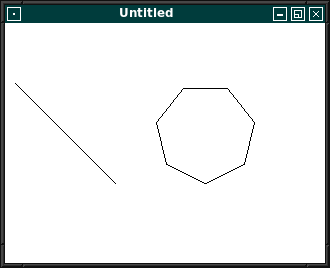

# 02 - Grafische Ausgabe
## 10 - Linien Style



Verschiedene Varinaten um Linien zu zeichnen:

---

```pascal
program Project1;

uses
  unixtype,
  ctypes,
  xlib,
  xutil,
  keysym,
  x;

type
  TMyWin = class(TObject)
  private
    dis: PDisplay;
    scr: cint;
    win: TWindow;
    gc: TGC;
  public
    constructor Create;
    destructor Destroy; override;
    procedure Run;
  end;

  constructor TMyWin.Create;
  begin
    inherited Create;

    // Erstellt die Verbindung zum Server
    dis := XOpenDisplay(nil);
    if dis = nil then begin
      WriteLn('Kann nicht das Display öffnen');
      Halt(1);
    end;
    scr := DefaultScreen(dis);
    gc := DefaultGC(dis, scr);

    // Erstellt das Fenster
    win := XCreateSimpleWindow(dis, RootWindow(dis, scr), 10, 10, 320, 240, 1, BlackPixel(dis, scr), WhitePixel(dis, scr));

    // Wählt die gewünschten Ereignisse aus
    // Es werden die Ereignisse **KeyPressMask** und **ExposureMask** für die grafische Auzsgabe gebraucht.
    XSelectInput(dis, win, KeyPressMask or ExposureMask);

    // Fenster anzeigen
    XMapWindow(dis, win);
  end;

  destructor TMyWin.Destroy;
  begin
    // Schliesst Verbindung zum Server
    XCloseDisplay(dis);
    inherited Destroy;
  end;

  procedure TMyWin.Run;
  const
    maxSektoren = 8;
  var
    Event: TXEvent;
    Points: array[0..maxSektoren] of TXPoint;
    i: integer;
  begin
    // Punkte in Kreisanordnung berechnen
    for i := 0 to maxSektoren - 1 do begin
      Points[i].x := round(Sin(Pi * 2 / (maxSektoren - 1) * i) * 50) + 200;
      Points[i].y := round(Cos(Pi * 2 / (maxSektoren - 1) * i) * 50) + 110;
    end;

    // Ereignisschleife
    while (True) do begin
      XNextEvent(dis, @Event);

      case Event._type of
        Expose: begin
          // Bildschirm löschen
          XClearWindow(dis, win);

          // Eine einfache Linie
          XSetLineAttributes(dis, gc, 10, LineSolid, CapButt, JoinBevel);
          XDrawLine(dis, win, gc, 10, 60, 110, 160);

          // Ein Linien-Array
          XSetLineAttributes(dis, gc, 3, LineDoubleDash, CapNotLast, JoinBevel);
          XDrawLines(dis, win, gc, @Points, Length(Points) - 1, 0);
        end;
        KeyPress: begin
          // Beendet das Programm bei [ESC]
          if XLookupKeysym(@Event.xkey, 0) = XK_Escape then begin
            Break;
          end;
        end;
      end;
    end;
  end;

var
  MyWindows: TMyWin;

begin
  MyWindows := TMyWin.Create;
  MyWindows.Run;
  MyWindows.Free;
end.
```


