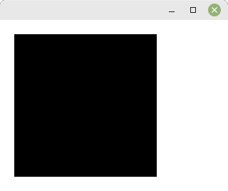

# 02 - Grafische Ausgabe
## 20 - Rechtecke

<br><br>
In den meisten Fällen ist es nötig, das man etwas auf das Fenster zeichnet.
Hier im Beispiel ist es ein einfaches Rechteck, welches mit <b>XFillRectangle</b> gezeichnet wird.
XFillRectangle(Display, Windows, GC, PosX, PosY, Breite, Höhe)
<hr><br>

```pascal
program Project1;

uses
  unixtype,
  ctypes,
  xlib,
  xutil,
  keysym,
  x;

type
  TMyWin = class(TObject)
  private
    dis: PDisplay;
    scr: cint;
    depth: cint;
    rootwin, win: TWindow;
    gc: TGC;
  public
    constructor Create;
    destructor Destroy; override;
    procedure Run;
  end;

  constructor TMyWin.Create;
  begin
    inherited Create;

    // Erstellt die Verbindung zum Server
    dis := XOpenDisplay(nil);
    if dis = nil then begin
      WriteLn('Kann nicht das Display öffnen');
      Halt(1);
    end;
    scr := DefaultScreen(dis);
    gc := DefaultGC(dis, scr);

    // Erstellt das Fenster
    win := XCreateSimpleWindow(dis, RootWindow(dis, scr), 10, 10, 320, 240, 1, BlackPixel(dis, scr), WhitePixel(dis, scr));

    // Wählt die gewünschten Ereignisse aus
    // Es werden die Ereignisse <b>KeyPressMask</b> und <b>ExposureMask</b> für die grafische Auzsgabe gebraucht.
    XSelectInput(dis, win, KeyPressMask or ExposureMask);

    // Fenster anzeigen
    XMapWindow(dis, win);
  end;

  destructor TMyWin.Destroy;
  begin
    // Schliesst Verbindung zum Server
    XCloseDisplay(dis);
    inherited Destroy;
  end;

  procedure TMyWin.Run;
  var
    Event: TXEvent;
  begin
    // Ereignisschleife
    while (True) do begin
      XNextEvent(dis, @Event);

      case Event._type of
        Expose: begin
          // Bildschirm löschen
          XClearWindow(dis, win);
          // Ein Rechteck zeichnen
          XDrawRectangle(dis, win, gc, 10, 50, 50, 50);
          // Einen rechteckigen Bereich mit Farbe füllen
          XFillRectangle(dis, win, gc, 110, 50, 50, 50);
        end;
        KeyPress: begin
          // Beendet das Programm bei [ESC]
          if XLookupKeysym(@Event.xkey, 0) = XK_Escape then begin
            Break;
          end;
        end;
      end;

    end;
  end;

var
  MyWindows: TMyWin;

begin
  MyWindows := TMyWin.Create;
  MyWindows.Run;
  MyWindows.Free;
end.
```


