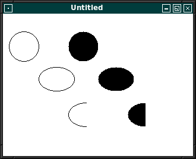

# 06 - Regionen
## 40 - Sprossen Fenster



Kreise und Elipsen zeichnen:

- [XDrawArc](https://tronche.com/gui/x/xlib/graphics/drawing/XDrawArc.html)
- [XFill](https://tronche.com/gui/x/xlib/graphics/filling-areas/XFillArc.html)

---

```pascal
program Project1;

uses
  unixtype,
  ctypes,
  xlib,
  xutil,
  keysym,
  x;

type
  TMyWin = class(TObject)
  private
    dis: PDisplay;
    scr: cint;
    win: TWindow;
    gc: TGC;
  public
    constructor Create;
    destructor Destroy; override;
    procedure Run;
  end;

  constructor TMyWin.Create;
  begin
    inherited Create;

    // Erstellt die Verbindung zum Server
    dis := XOpenDisplay(nil);
    if dis = nil then begin
      WriteLn('Kann nicht das Display öffnen');
      Halt(1);
    end;
    scr := DefaultScreen(dis);
    gc := DefaultGC(dis, scr);

    // Erstellt das Fenster
    win := XCreateSimpleWindow(dis, RootWindow(dis, scr), 10, 10, 320, 240, 1, BlackPixel(dis, scr), WhitePixel(dis, scr));

    // Wählt die gewünschten Ereignisse aus
    // Es werden die Ereignisse **KeyPressMask** und **ExposureMask** für die grafische Auzsgabe gebraucht.
    XSelectInput(dis, win, KeyPressMask or ExposureMask);

    // Fenster anzeigen
    XMapWindow(dis, win);
  end;

  destructor TMyWin.Destroy;
  begin
    // Schliesst Verbindung zum Server
    XCloseDisplay(dis);
    inherited Destroy;
  end;

  procedure TMyWin.Run;
  var
    Event: TXEvent;
    Region: TRegion;
    r: TXRectangle;
    i: integer;

    function Rect(Left, Top, Width, Height: cshort): TXRectangle;
    begin
      Result.x := Left;
      Result.y := Top;
      Result.Width := Width;
      Result.Height := Height;
    end;

  begin
    // Ereignisschleife
    while (True) do begin
      XNextEvent(dis, @Event);

      case Event._type of
        Expose: begin
          XClearWindow(dis, win);

          Region := XCreateRegion;

          r := Rect(10, 10, 100, 100);
          WriteLn(XEmptyRegion(Region));
          XUnionRectWithRegion(@r, Region, Region);
          WriteLn(XEmptyRegion(Region));

          r := Rect(115, 10, 100, 100);
          XUnionRectWithRegion(@r, Region, Region);

          r := Rect(10, 115, 100, 100);
          XUnionRectWithRegion(@r, Region, Region);

          r := Rect(115, 115, 100, 100);
          XUnionRectWithRegion(@r, Region, Region);
                    XOffsetRegion(Region, 50,50);
//          XShrinkRegion(Region, 45, 45);
          //                    XRectInRegion(Region, 50,50,150,150);

          XSetRegion(dis, gc, Region);
          XDestroyRegion(Region);


          // Einen Kreis zeichnen
          for i := 0 to 100 do begin
            XSetForeground(dis, gc, Random( $FFFFFF));
            XDrawArc(dis, win, gc, random(500)-200, random(500)-200, 150, 150, 0, 360 * 64);
          end;

        end;
        KeyPress: begin
          // Beendet das Programm bei [ESC]
          if XLookupKeysym(@Event.xkey, 0) = XK_Escape then begin
            Break;
          end;
        end;
      end;

    end;
  end;

var
  MyWindows: TMyWin;

begin
  MyWindows := TMyWin.Create;
  MyWindows.Run;
  MyWindows.Free;
end.
```


