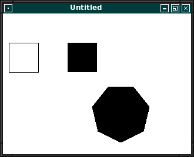

# 20 - Komponenten
## 10 - Komponenten Basis



Verschiedene Varinaten um Rechtecke zu zeichnen:

- [XDrawRectangle](https://tronche.com/gui/x/xlib/graphics/filling-areas/XDrawRectangle.html)
- [XFillRectangle](https://tronche.com/gui/x/xlib/graphics/filling-areas/XFillRectangle.html)
- [XFillPolygon](https://tronche.com/gui/x/xlib/graphics/filling-areas/XFillPolygon.html) (Für ein nicht ausgefülltes Polygon nimmt man **XDrawLines**.)

---

```pascal
program Project1;

uses
  unixtype,
  ctypes,
  xlib,
  xutil,
  keysym,
  x,
  X11Button,
  X11Component,
  X11Panel,
  X11Window;

type

  { TMyWin }

  TMyWin = class(TX11Window)
  private
    Panel, PanelSub: TX11Panel;
    Button: array[0..3] of TX11Button;
    CloseButton: TX11Button;
    procedure ButtonClick(Sender: TObject);
    procedure CloseButtonClick(Sender: TObject);
    procedure CloseButtonMouseMove(Sender: TObject; X, Y: integer);
    protected
      procedure DoOnPaint; override;
      procedure DoOnEventHandle(Event: TXEvent); override;
  public
    constructor Create(TheOwner: TX11Component);
    destructor Destroy; override;
  end;

var
  MyWindows: TMyWin;

  { TMyWin }

  procedure TMyWin.ButtonClick(Sender: TObject);
  begin
    WriteLn(TX11Button(Sender).Caption);
  end;

  procedure TMyWin.CloseButtonClick(Sender: TObject);
  begin
    AppClose := True;
  end;

  procedure TMyWin.CloseButtonMouseMove(Sender: TObject; X, Y: integer);
  begin
    WriteLn('move: ', x, '  ', y);
  end;

  constructor TMyWin.Create(TheOwner: TX11Component);
  var
    i: integer;
    s: string;
  begin
    inherited Create(TheOwner);

    Panel := TX11Panel.Create(Self);
    with Panel do begin
      Color := $444444;
      Left := 10;
      Top := 10;
      Height := 100;
      Width := 330;
//      Anchors:=[akTop,akLeft, akRight, akBottom];
    end;

    PanelSub := TX11Panel.Create(Panel);
    with PanelSub do begin
      Color := $999999;
      Left := 10;
      Top := 10;
      Height := 50;
      Width := 1310;
//                  Anchors:=[akTop,akLeft, akRight, akBottom];
    end;

    for i := 0 to Length(Button) - 1 do begin
      Button[i] := TX11Button.Create(PanelSub);
      Button[i].Width := 80;
      Button[i].Left := 5 + i * (Button[0].Width + 5);
      Button[i].Top := 5;

      str(i, s);
      Button[i].Caption := 'Button' + s;
      Button[i].Name := 'Button' + s;
      Button[i].OnClick := @ButtonClick;
    end;
    Button[1].Color := $8888FF;
    Button[2].Color := $88FF88;
    Button[3].Color := $FF8888;

    CloseButton := TX11Button.Create(Self);
    with CloseButton do begin
      Left := 100;
      Top := 100;
      Width := 60;
      Height := 25;
      Anchors := [akRight, akBottom];
//            Anchors:=[akTop,akLeft, akRight, akBottom];
      Caption := 'Close';
      OnClick := @CloseButtonClick;
      OnMouseMove := @CloseButtonMouseMove;
    end;
  end;

  destructor TMyWin.Destroy;
  var
    i: integer;
  begin
    for i := 0 to Length(Button) - 1 do begin
      Button[i].Free;
    end;
    PanelSub.Free;
    Panel.Free;
    CloseButton.Free;
    inherited Destroy;
  end;

  procedure TMyWin.DoOnPaint;
  const
    maxSektoren = 8;
  var
    punkte: array[0..maxSektoren] of TXPoint;
    i: integer;
    //      Region2: TRegion;
    //    Rect: TXRectangle;
  begin
    inherited DoOnPaint;
    color := $FF00;
    //Region2 := XCreateRegion;
    //Rect.x := 0;
    //Rect.y := 0;
    //Rect.Width := Width;
    //Rect.Height := Height;
    //XUnionRectWithRegion(@Rect, Region2, Region2);
    XSetRegion(dis, gc, Region);
    //XDestroyRegion(Region2);

    for i := 0 to maxSektoren - 1 do begin
      punkte[i].x := round(Sin(Pi * 2 / (maxSektoren - 1) * i) * 50) + 250;
      punkte[i].y := round(Cos(Pi * 2 / (maxSektoren - 1) * i) * 50) + 220;
    end;

    //      XClearWindow(dis, win);
    // Ein Rechteck zeichnen
    XSetForeground(dis, gc, $FF00FF);
    XDrawRectangle(dis, win, gc, 10, 150, 50, 50);
    // Einen rechteckigen Bereich mit Farbe füllen
    XFillRectangle(dis, win, gc, 110, 150, 50, 50);

    // Ein Polygon
    XFillPolygon(dis, win, gc, @punkte, Length(punkte) - 1, 0, CoordModeOrigin);
  end;

  procedure TMyWin.DoOnEventHandle(Event: TXEvent);
  begin
    inherited DoOnEventHandle(Event);
    case Event._type of
      KeyPress: begin
        if XLookupKeysym(@Event.xkey, 0) = XK_Escape then begin
          AppClose := True;
        end;
      end;
    end;
  end;

begin
  MyWindows := TMyWin.Create(nil);
  MyWindows.Run;
  MyWindows.Free;
end.
```


