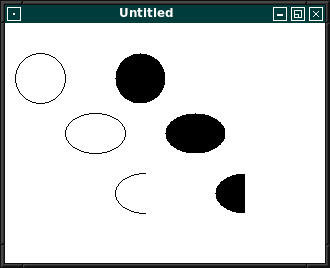

# FPC X11
## Einleitung
Hinweis: Die Sourcen auf GitHub sind aktueller als das Wiki. 
Auch befinden sich Beispiele auf GitHub, welche im Wiki nicht dokumentiert sind. 
## Tutorial
* [Einfuehrung](#einfuehrung)
* [Grafische_Ausgabe](#grafische-ausgabe)
* [Textausgabe](#textausgabe)
* [Event_Handle](#event-handle)
* [Maus](#maus)
* [Tastatur](#tastatur)
* [Regionen](#regionen)
* [Komponenten](#komponenten)
 [testlink](#radiobutton)
### Einfuehrung
| Link | Beschreibung
| :---: | ---
| [Einfuehrung in X11](01_-_Einfuehrung/00_-_Einfuehrung_in_X11/readme.md) | 
| [Erstes Fenster](01_-_Einfuehrung/05_-_Erstes_Fenster/readme.md) | 
| [Besser mit Klassen](01_-_Einfuehrung/10_-_Besser_mit_Klassen/readme.md) | 
| [Ereignisse](01_-_Einfuehrung/15_-_Ereignisse/readme.md) | 
| [Mehrere Fenster](01_-_Einfuehrung/20_-_Mehrere_Fenster/readme.md) | 
| [Fenster im Fenster](01_-_Einfuehrung/25_-_Fenster_im_Fenster/readme.md) | 
| [GC](01_-_Einfuehrung/30_-_GC/readme.md) | 
| [Fenster Info](01_-_Einfuehrung/35_-_Fenster_Info/readme.md) | 
| [Timer](01_-_Einfuehrung/40_-_Timer/readme.md) | 
### Grafische Ausgabe
| Link | Beschreibung
| :---: | ---
| [Erstes Rechteck](02_-_Grafische_Ausgabe/00_-_Erstes_Rechteck/readme.md) | 
| [Linien](02_-_Grafische_Ausgabe/05_-_Linien/readme.md) | 
| [Linien Style](02_-_Grafische_Ausgabe/10_-_Linien_Style/readme.md) | 
| [Rechtecke und Polygone](02_-_Grafische_Ausgabe/15_-_Rechtecke_und_Polygone/readme.md) | 
| [Rechtecke Style](02_-_Grafische_Ausgabe/20_-_Rechtecke_Style/readme.md) | 
| [Kreise](02_-_Grafische_Ausgabe/25_-_Kreise/readme.md) | 
| [Bitmap](02_-_Grafische_Ausgabe/30_-_Bitmap/readme.md) | 
| [Bitmap Array](02_-_Grafische_Ausgabe/35_-_Bitmap_Array/readme.md) | 
| [Bitmap TBitmap](02_-_Grafische_Ausgabe/40_-_Bitmap_TBitmap/readme.md) | 
| [Bitmap von bmp geht nicht](02_-_Grafische_Ausgabe/45_-_Bitmap_von_bmp_geht_nicht/readme.md) | 
| [Bereich loeschen](02_-_Grafische_Ausgabe/50_-_Bereich_loeschen/readme.md) | 
| [Bereich kopieren](02_-_Grafische_Ausgabe/55_-_Bereich_kopieren/readme.md) | 
### Textausgabe
| Link | Beschreibung
| :---: | ---
| [UTF8](10_-_Textausgabe/00_-_UTF8/readme.md) | 
| [FontListe](10_-_Textausgabe/05_-_FontListe/readme.md) | 
| [UTF8 bold](10_-_Textausgabe/10_-_UTF8_bold/readme.md) | 
| [Font groesse ermitteln](10_-_Textausgabe/15_-_Font_groesse_ermitteln/readme.md) | 
| [Font groesse ermitteln Char16Bit](10_-_Textausgabe/20_-_Font_groesse_ermitteln_Char16Bit/readme.md) | 
| [Font groesse ermitteln Char16Bit dynamic Array](10_-_Textausgabe/25_-_Font_groesse_ermitteln_Char16Bit_dynamic_Array/readme.md) | 
| [Font groesse ermitteln UTF8](10_-_Textausgabe/30_-_Font_groesse_ermitteln_UTF8/readme.md) | 
### Event Handle
| Link | Beschreibung
| :---: | ---
| [Events senden auswerten](20_-_Event_Handle/00_-_Events_senden_auswerten/readme.md) | 
| [Events senden](20_-_Event_Handle/05_-_Events_senden/readme.md) | 
| [Resize](20_-_Event_Handle/10_-_Resize/readme.md) | 
| [xkill abfangen](20_-_Event_Handle/15_-_xkill_abfangen/readme.md) | 
### Maus
| Link | Beschreibung
| :---: | ---
| [Verhalten mehrere Fenster](40_-_Maus/00_-_Verhalten_mehrere Fenster/readme.md) | 
### Tastatur
| Link | Beschreibung
| :---: | ---
| [Erste Versuche](50_-_Tastatur/00_-_Erste_Versuche/readme.md) | 
| [UTF8](50_-_Tastatur/05_-_UTF8/readme.md) | 
| [UTF8 test](50_-_Tastatur/10_-_UTF8_test/readme.md) | 
### Regionen
| Link | Beschreibung
| :---: | ---
| [Region](70_-_Regionen/00_-_Region/readme.md) | 
| [Pruefen ob Region vorhanden](70_-_Regionen/05_-_Pruefen_ob_Region_vorhanden/readme.md) | 
| [Regionen verschieben](70_-_Regionen/10_-_Regionen_verschieben/readme.md) | 
| [UnionRegion (OR)](70_-_Regionen/15_-_UnionRegion_(OR)/readme.md) | 
| [IntersectRegion (AND)](70_-_Regionen/20_-_IntersectRegion_(AND)/readme.md) | 
| [XorRegion (XOR)](70_-_Regionen/25_-_XorRegion_(XOR)/readme.md) | 
| [Subtractregion (minus)](70_-_Regionen/30_-_Subtractregion_(minus)/readme.md) | 
| [Rechteckige Regionen](70_-_Regionen/35_-_Rechteckige_Regionen/readme.md) | 
| [Ist Punkt in Region](70_-_Regionen/40_-_Ist_Punkt_in_Region/readme.md) | 
### Komponenten
| Link | Beschreibung
| :---: | ---
| [Einfüehrung Komponenten](90_-_Komponenten/00_-_Einfüehrung_Komponenten/readme.md) | 
| [Einfache Button](90_-_Komponenten/05_-_Einfache_Button/readme.md) | 
| [Komponenten Basis Region](90_-_Komponenten/10_-_Komponenten_Basis_Region/readme.md) | 
| [Komponenten Basis Window](90_-_Komponenten/15_-_Komponenten_Basis_Window/readme.md) | 
