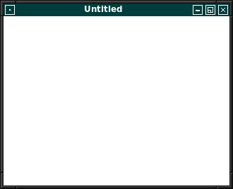

# FPC X11
## Einleitung
Hinweis: Die Sourcen auf GitHub sind aktueller als das Wiki. 
Auch befinden sich Beispiele auf GitHub, welche im Wiki nicht dokumentiert sind. 
## Tutorial
* [Einfuehrung](#einfuehrung)
* [Grafische_Ausgabe](#grafische-ausgabe)
* [Maus](#maus)
* [Tastatur](#tastatur)
* [Regionen](#regionen)
* [Komponenten](#komponenten)
 [testlink](#radiobutton)
### Einfuehrung
| Link | Beschreibung
| :---: | ---
| [Einfuehrung in X11](01_-_Einfuehrung/00_-_Einfuehrung_in_X11/readme.md) | 
| [Erstes Fenster](01_-_Einfuehrung/03_-_Erstes_Fenster/readme.md) | 
| [Besser mit Klassen](01_-_Einfuehrung/05_-_Besser_mit_Klassen/readme.md) | 
| [Ereignisse](01_-_Einfuehrung/10_-_Ereignisse/readme.md) | 
| [Fenster im Fenster](01_-_Einfuehrung/15_-_Fenster_im_Fenster/readme.md) | 
| [Fenster im Fenster Vwersuche](01_-_Einfuehrung/15_-_Fenster_im_Fenster_Vwersuche/readme.md) | 
| [Mehrere  Fenster](01_-_Einfuehrung/25_-_Mehrere _Fenster/readme.md) | 
### Grafische Ausgabe
| Link | Beschreibung
| :---: | ---
| [Erstes Rechteck](02_-_Grafische_Ausgabe/00_-_Erstes_Rechteck/readme.md) | 
| [Linien](02_-_Grafische_Ausgabe/05_-_Linien/readme.md) | 
| [Linien Style](02_-_Grafische_Ausgabe/07_-_Linien_Style/readme.md) | 
| [Rechtecke und Polygone](02_-_Grafische_Ausgabe/10_-_Rechtecke_und_Polygone/readme.md) | 
| [Rechtecke Style](02_-_Grafische_Ausgabe/11_-_Rechtecke_Style/readme.md) | 
| [Kreise](02_-_Grafische_Ausgabe/15_-_Kreise/readme.md) | 
| [Bitmap](02_-_Grafische_Ausgabe/20_-_Bitmap/readme.md) | 
| [Bitmap Array](02_-_Grafische_Ausgabe/20_-_Bitmap_Array/readme.md) | 
| [Bitmap TBitmap](02_-_Grafische_Ausgabe/20_-_Bitmap_TBitmap/readme.md) | 
| [Bitmap von bmp geht nicht](02_-_Grafische_Ausgabe/20_-_Bitmap_von_bmp_geht_nicht/readme.md) | 
| [Bereich loeschen](02_-_Grafische_Ausgabe/30_-_Bereich_loeschen/readme.md) | 
| [Bereich kopieren](02_-_Grafische_Ausgabe/35_-_Bereich_kopieren/readme.md) | 
### Maus
| Link | Beschreibung
| :---: | ---
| [Verhalten mehrere Fenster](03_-_Maus/15_-_Verhalten_mehrere Fenster/readme.md) | 
### Tastatur
| Link | Beschreibung
| :---: | ---
### Regionen
| Link | Beschreibung
| :---: | ---
| [Region](06_-_Regionen/00_-_Region/readme.md) | 
| [Pruefen ob Region vorhanden](06_-_Regionen/05_-_Pruefen_ob_Region_vorhanden/readme.md) | 
| [Regionen verschieben](06_-_Regionen/07_-_Regionen_verschieben/readme.md) | 
| [UnionRegion (OR)](06_-_Regionen/10_-_UnionRegion_(OR)/readme.md) | 
| [IntersectRegion (AND)](06_-_Regionen/15_-_IntersectRegion_(AND)/readme.md) | 
| [XorRegion (XOR)](06_-_Regionen/20_-_XorRegion_(XOR)/readme.md) | 
| [Subtractregion (minus)](06_-_Regionen/25_-_Subtractregion_(minus)/readme.md) | 
| [Rechteckige Regionen](06_-_Regionen/30_-_Rechteckige_Regionen/readme.md) | 
| [Ist Punkt in Region](06_-_Regionen/35_-_Ist_Punkt_in_Region/readme.md) | 
### Komponenten
| Link | Beschreibung
| :---: | ---
| [Einfüehrung Komponenten](20_-_Komponenten/00_-_Einfüehrung_Komponenten/readme.md) | 
| [Einfache Button](20_-_Komponenten/05_-_Einfache_Button/readme.md) | 
| [Komponenten Basis Region](20_-_Komponenten/10_-_Komponenten_Basis_Region/readme.md) | 
| [Komponenten Basis Window](20_-_Komponenten/15_-_Komponenten_Basis_Window/readme.md) | 
