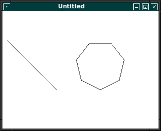

# FPC X11
## Einleitung
Hinweis: Die Sourcen auf GitHub sind aktueller als das Wiki. 
Auch befinden sich Beispiele auf GitHub, welche im Wiki nicht dokumentiert sind. 
## Tutorial
* [Einfuehrung](#einfuehrung)
* [Grafische_Ausgabe](#grafische-ausgabe)
* [Tastatur](#tastatur)
* [Regionen](#regionen)
* [Komponenten](#komponenten)
 [testlink](#radiobutton)
### Einfuehrung
| Link | Beschreibung
| :---: | ---
| [Erstes Fenster](01_-_Einfuehrung/00_-_Erstes_Fenster/readme.md) | 
| [Besser mit Klassen](01_-_Einfuehrung/05_-_Besser_mit_Klassen/readme.md) | 
### Grafische Ausgabe
| Link | Beschreibung
| :---: | ---
| [Erstes Rechteck](02_-_Grafische_Ausgabe/00_-_Erstes_Rechteck/readme.md) | 
| [Linien](02_-_Grafische_Ausgabe/05_-_Linien/readme.md) | 
| [Rechtecke und Polygone](02_-_Grafische_Ausgabe/10_-_Rechtecke_und_Polygone/readme.md) | 
| [Kreise](02_-_Grafische_Ausgabe/15_-_Kreise/readme.md) | 
### Tastatur
| Link | Beschreibung
| :---: | ---
### Regionen
| Link | Beschreibung
| :---: | ---
| [Region](06_-_Regionen/00_-_Region/readme.md) | 
| [Sprossen Fenster](06_-_Regionen/05_-_Sprossen_Fenster/readme.md) | 
| [UnionRegion (OR)](06_-_Regionen/10_-_UnionRegion_(OR)/readme.md) | 
| [IntersectRegion (AND)](06_-_Regionen/15_-_IntersectRegion_(AND)/readme.md) | 
| [XorRegion (XOR)](06_-_Regionen/20_-_XorRegion_(XOR)/readme.md) | 
| [Subtractregion (minus)](06_-_Regionen/25_-_Subtractregion_(minus)/readme.md) | 
### Komponenten
| Link | Beschreibung
| :---: | ---
| [Einfüehrung Komponenten](20_-_Komponenten/00_-_Einfüehrung_Komponenten/readme.md) | 
| [Einfache Button](20_-_Komponenten/05_-_Einfache_Button/readme.md) | 
| [Komponenten Basis](20_-_Komponenten/10_-_Komponenten_Basis/readme.md) | 
